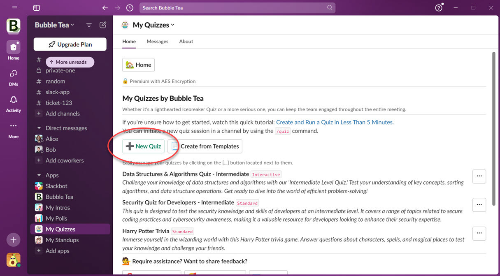
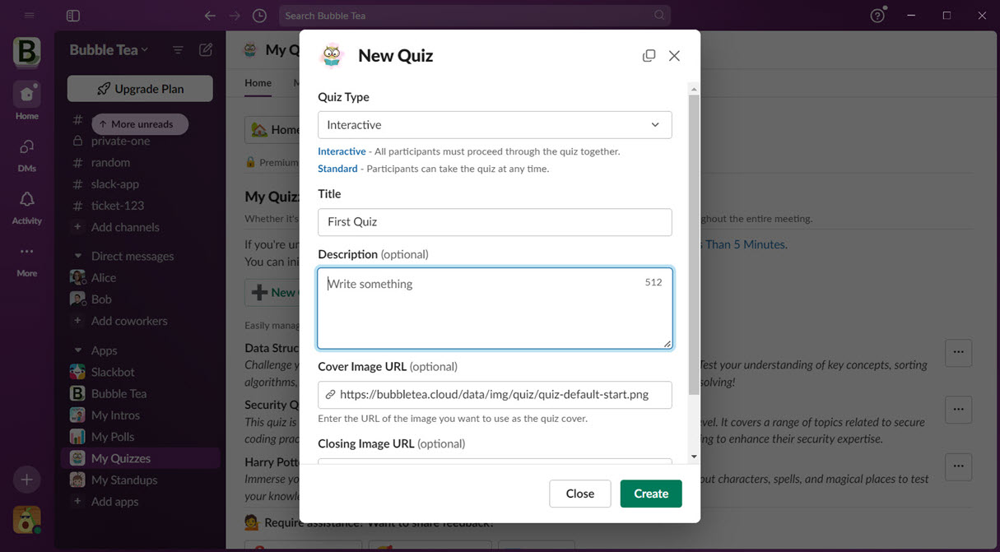
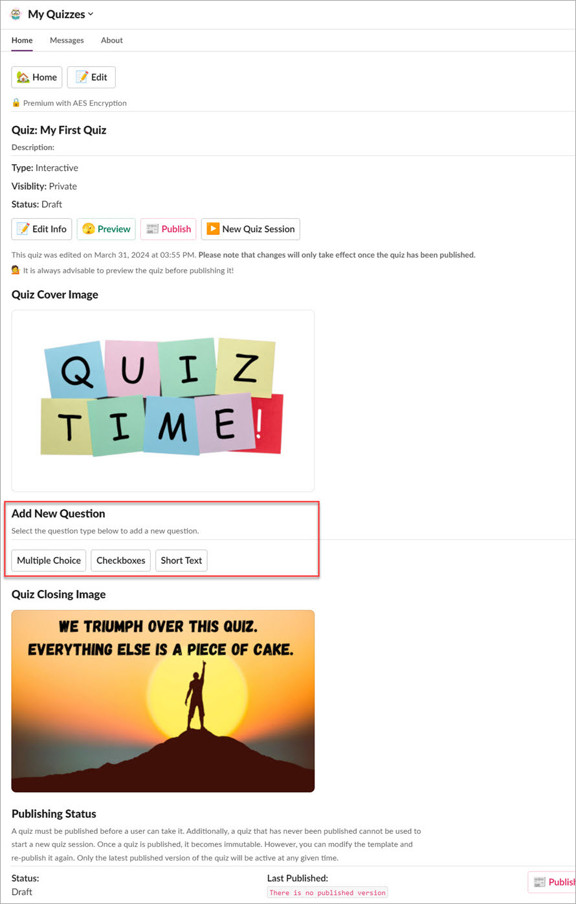
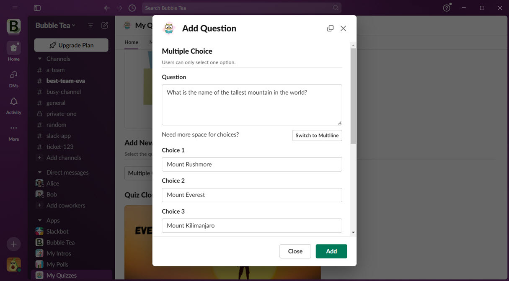
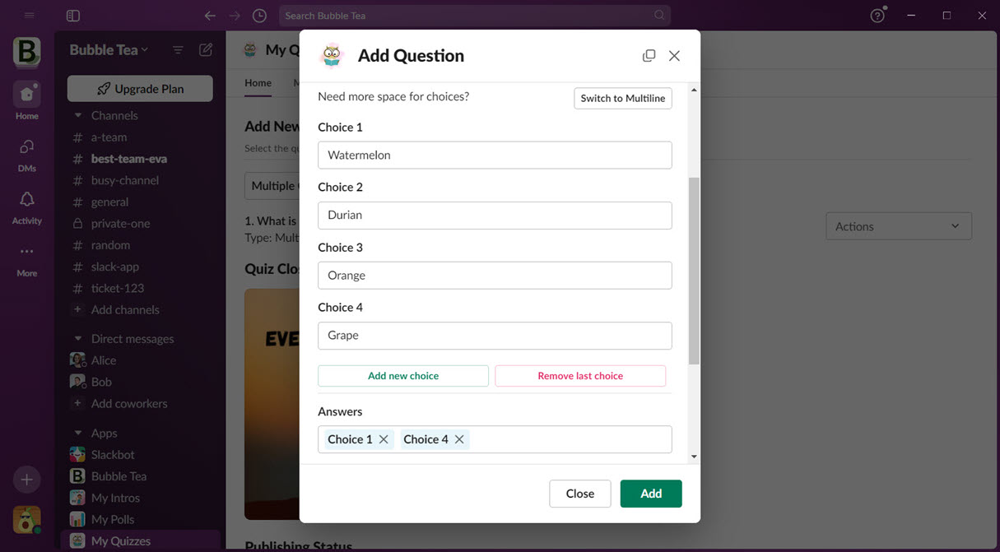
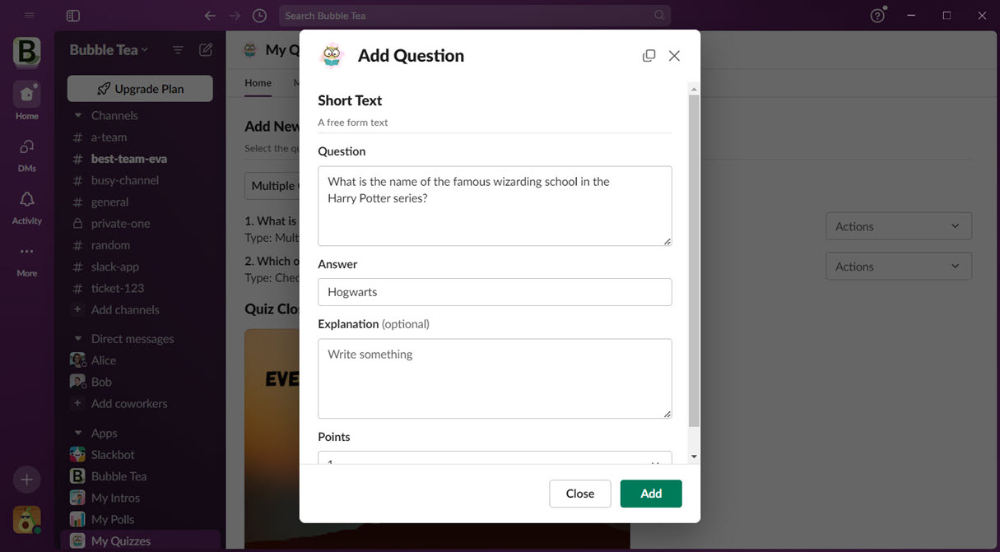

# Quiz Authoring

You can easily create a new quiz using the Slack native quiz builder in the app's home tab. Currently, we support three question types: multiple choice, checkboxes, and short text. A multiple-choice question allows users to select only one option from the available choices, while a checkboxes question allows users to select as many as they want. Short text is a free-form text format where users have to type their answers.

## 1. Exploring the Quiz Home Tab
The Quiz Home Tab is where you can create a new quiz, start a quiz session, or view the quiz results. 
You can do a number of things from the home tab interface without leaving Slack at all.
Let's create a new quiz from scratch. Go ahead and click on **New Quiz**.

## 2. Creating a New Quiz
After clicking **New Quiz**, the Quiz dialog will appear as shown below. Don't worry about the details here, as you can change any of them anytime in the quiz builder. We'll explore the quiz types later, but for now, you can choose either of them. More details about the quiz types can be found [here](quiz-types.md). The quiz cover image and closing image are provided by default, but you can change or remove them if you prefer.  

## 3. Designing a Quiz in the Quiz Builder
After creating the quiz, the system will redirect you to the quiz builder interface where you can begin adding questions.
You can edit the quiz information entered earlier, preview your quiz before publishing, publish your quiz, or start a new quiz session from this interface.
Since there are currently no questions in the quiz, let's scroll down to the **Add New Question** section.
We will add a question for each question type in the same order as the buttons.

## 4. Adding a Multiple Choice Question
When you click the Multiple Choice button, the question dialog will appear. In this interface, you can enter the question, the choices, the score for this question, and the explanation for the answer. Initially, you will see two question choices, and you can add or remove them as needed.

If each choice requires multiple lines to be clear, you can click the Switch to Multiline button to activate multiline mode. Multiline mode is useful for displaying multiple paragraphs or code blocks.

Please note that all text fields here support [Slack markdown](https://slack.com/help/articles/202288908-Format-your-messages) and emojis. The possibilities are limited only by your imagination!

## 5. Adding a Checkboxes Question
After creating the first question in multiple-choice format, you can explore another question type: checkboxes format. This format allows users to select more than one option. Everything is the same as the multiple-choice question, except that you can add more than one correct answer to the question.

## 6. Adding a Short Text Question
Now that we've created two questions, one with the multiple-choice format and the other with the checkboxes format, let's create the final question. We'll use the short text format for this question. A short text question allows users to type their answer. Don't worry about case or spacing; the system will normalize the string before comparing it with the correct answer.

## 7. Managing Quiz Questions
Now we have three questions. If you're not satisfied with the order, you can rearrange the questions. You have the option to edit or delete any question. Please note that once a question type is created, it cannot be changed. If you wish to change the question type, you'll need to create a new question and copy the values over. At this stage, you may want to preview your quiz before publishing it.

## Things You Need to Know About Quizzes
- Your quiz can undergo unlimited revisions.
- Quiz revisions are immutable. You cannot alter a quiz that users have taken or completed.
- You can make changes at any time, and the changes are committed to your quiz template (which is not yet published).
- When you're ready, you can publish your changes to the latest revision.
- The latest revision won't affect ongoing quizzes; it only affects new quiz sessions.

----

We apologize if this concept seems a bit complex. Data integrity is our top priority. You can rest assured that no one can alter the quiz session or its results.

