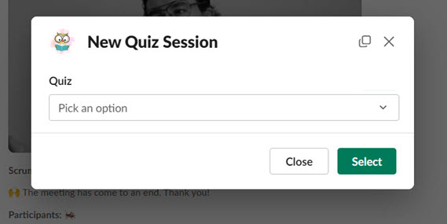
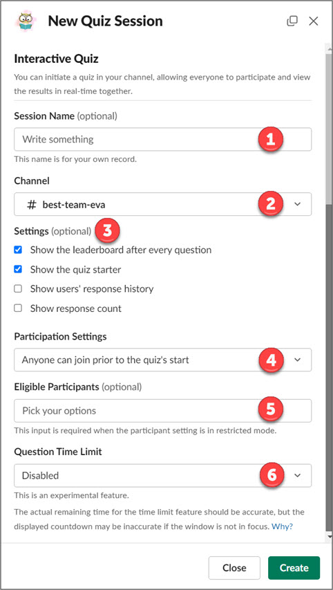
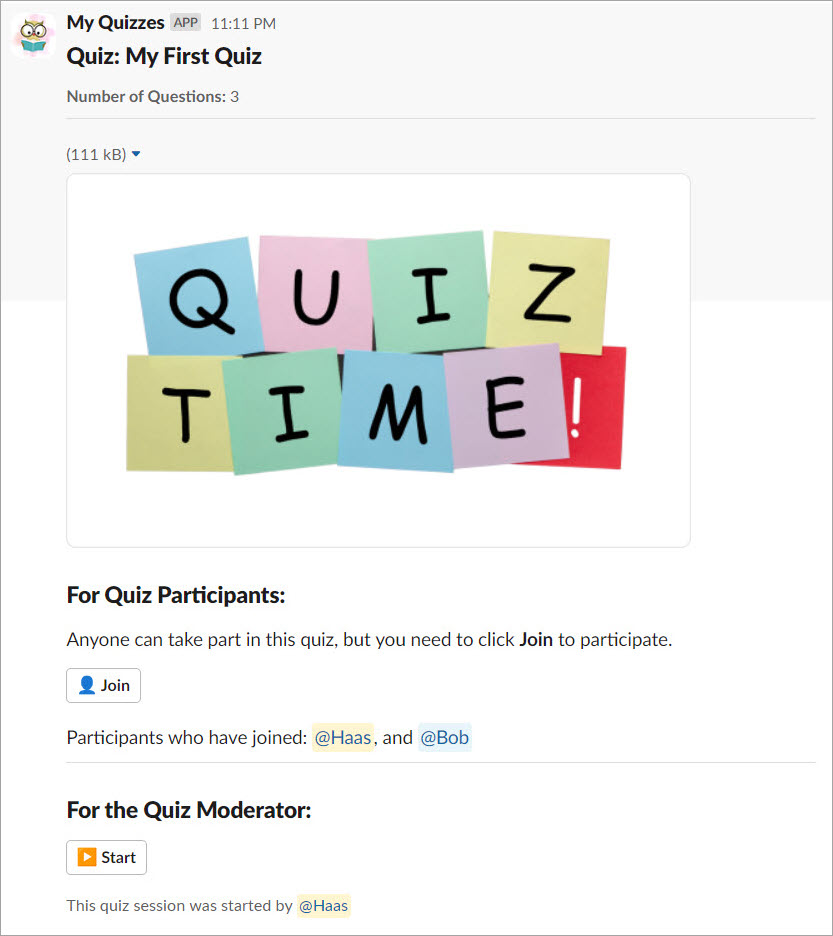
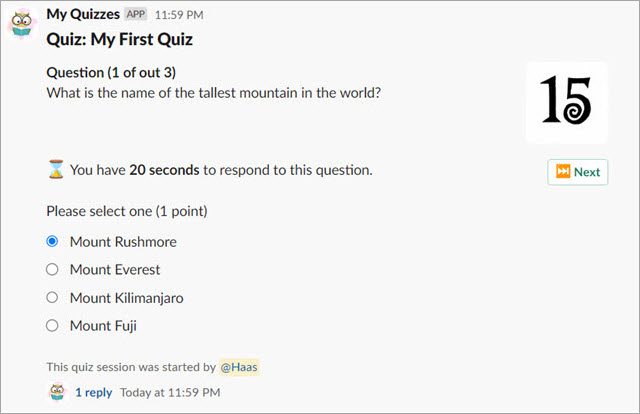
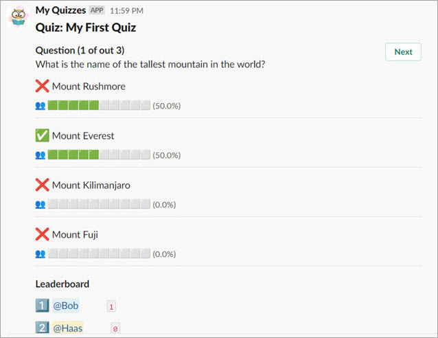
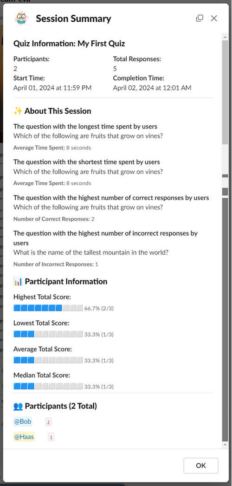

# Interactive Quiz Explained

An Interactive Quiz is a game-style quiz where all participants progress through the quiz at the same pace. Each participant completes the same question one at a time until the quiz concludes. At the end of each question, quiz participants may view the leaderboard, which displays the top five users with the highest scores. This type of quiz is suitable for ice-breaking activities like trivia games, birthday party games (where questions may be about the birthday person), or competitive games where participants vie for rewards.

!!! note "Number of participants"
    We recommend that the number of participants should not exceed 20 users, or 10 users for quizzes with a significant number of questions. While you might be able to accommodate more users, such as 50 or even 100, please note that the limit imposed by the Slack API applies per workspace.

When creating a quiz for the first time, you must specify the quiz type. In [the Quiz Authoring tutorial](tutorial-quiz-authoring.md), we selected the **Interactive** type. If you followed the tutorial in order, there's no need to change anything. However, if you deviated from the tutorial sequence, please edit the quiz and change the type to **Interactive** before proceeding.

## Starting a New Session

A quiz session is the event during which participants can take part in the quiz. In an interactive quiz, it's important to ensure that all participants are online and ready to take the quiz, with you acting as the moderator. The interactive quiz will occur in the specified Slack channel, whether it's a private or public channel. For private channels, please ensure that the bot is added to the channel before proceeding to avoid permission errors.

You can initiate a quiz session directly from the quiz home tab, the quiz builder interface, or in any channel using the slash command `/quiz` or `/myquiz`

Please proceed by clicking the **New Quiz Session** button or running the `/quiz` command. If you run it from the command and have more than one quiz, you'll be prompted to select which one you want to start.

**Note:** When initiating a quiz session for the first time, the system will automatically publish your quiz if it hasn't been published previously. Otherwise, the latest revision will be used.

## Configuring an Interactive Session

Each time you begin a new session, you'll have the opportunity to designate the posting channel for the quiz, determine participants, and specify the information to be displayed. Additionally, in the premium version, you can set a time limit per question.

1. **Session Name:** This field is optional. It serves as the session name for your recording, providing a memorable identifier for this quiz session.
2. **Channel:** The channel to which this quiz session will be posted. If you initiate a new session using the slash command `/quiz`, the system will automatically select the current channel as your desired channel.
3. **Settings:**
    - **Show the leaderboard after every question** After each question, the top 5 participants with the highest scores will be displayed.
    - **Show the quiz starter** Display who initiated this quiz session. The quiz starter is also considered a moderator.
    - **Show users' response history** When this option is selected, user responses will be recorded in a thread. You will only see your own responses since the messages will be posted in ephemeral mode.
    - **Show response count** The response count is per question and will be posted as the first message in a thread instead of updating the main message. This approach is necessary due to limitations imposed by the concurrent nature of this use case and Slack API.
4. **Participation Settings:**
    - **Anyone can join prior to the quiz's start** Anyone can participate in the quiz, but they must join before the quiz starts.
    - **Anyone can join the quiz at any time** Anyone can participate in the quiz, and they can join at any time while the quiz is in progress.
    - **Restricted participants can join prior to the quiz's start** Only selected users can participate in the quiz, and they must join before the quiz starts.
    - **Restricted participants can join the quiz at any time** Only selected users can participate in the quiz, and they can join at any time while the quiz is in progress.
5. **Eligible Participants:** A list of users who can participate in the quiz. You must specify this list if the participation setting is restricted.
6. **Question Time Limit:** You can specify the time limit for each question. When the time is up, users won't be able to provide an answer, and the quiz will automatically move to the next question.

## Starting an Interactive Session

Once the quiz is posted (started), the quiz cover will appear in the targeted channel. If the quiz session settings require participants to join before the quiz starts, you will see a button named **Join**. In this case, you won't be able to start the quiz unless at least one user has participated. All users who want to participate will appear under the **Join** button. The quiz moderator can observe the number of participants before starting the quiz.

## Answering the Question

Once the quiz is started, the first question will appear automatically. If a time limit is set, an animated countdown image will be displayed. When the time is up, the quiz will proceed to the next question. As a quiz moderator, you can move to the next question without waiting for the time to expire.

Before the next question appears, you will see the result screen showing the performance of the participant in the previous question. If the option **Show the quiz starter** is checked, you will see the leaderboard underneath the questions. At this point, a quiz moderator has to click **Next** to start the next question.

## After the Quiz Ends

At the conclusion of the quiz, you will be presented with the closing image you've chosen, and the scoreboard will be displayed. At this juncture, you'll have the chance to view a detailed report of this quiz session. Simply click the **View Summary** button to do so.

## Viewing the Quiz Session Summary

The session summary will provide insightful information about the quiz and its participants. You'll discover which question took the longest time and which ones most users answered incorrectly. Additionally, statistical data on scores, including total average, highest, lowest, and median scores, will be available. Utilize this information to enhance the quiz in future versions.

---
