# Standard Quiz Explained

A standard quiz allows participants to proceed at their own pace. However, participants must complete the quiz before the set deadline, if applicable, to receive a score. This type of quiz supports a large number of participants, unlike the interactive quiz. 

!!! note "Number of participants"
    Because this quiz does not update messages in a channel, it theoretically supports an unlimited number of participants. However, for regular licenses, we recommend not exceeding 500 users, and for enterprise licenses, not exceeding 3,000 users. If you require support for larger numbers, please don't hesitate to contact us, and we'll gladly assist you.

When creating a quiz for the first time, you must specify the quiz type. If the quiz type is not set to **Standard**, please change it to **Standard** by clicking **Edit Info** and then selecting **Standard** as the type before proceeding.

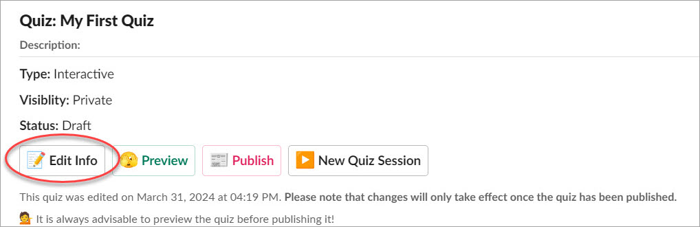

## Starting a New Session

A standard quiz session differs from an interactive quiz in several ways. Firstly, in a standard session, participants aren't required to take the same questions simultaneously; they can proceed at their own pace. Additionally, participants won't see each other's scores by default; the quiz moderator can decide whether to share them or not. The quiz moderator also has the option to export the quiz results to a CSV file. Secondly, standard quiz sessions typically span longer durations, lasting for days or even months, whereas interactive quizzes are much shorter, usually lasting from a few minutes to an hour.

The quiz will be delivered to all invitees via direct message channels at a specified time. You need not worry about channel permissions, as the bot can send direct messages to individuals based on OAuth permissions.

You can initiate a quiz session directly from the quiz home tab, the quiz builder interface, or in any channel using the slash command `/quiz` or `/myquiz`

Please proceed by clicking the **New Quiz Session** button or running the `/quiz` command. If you run it from the command and have more than one quiz, you'll be prompted to select which one you want to start.

## Configuring a Standard Session

Each time you start a new session, you'll be able to establish the quiz rules, select users who will receive the quiz, set the start time and deadline, and determine the passing percentage if applicable.

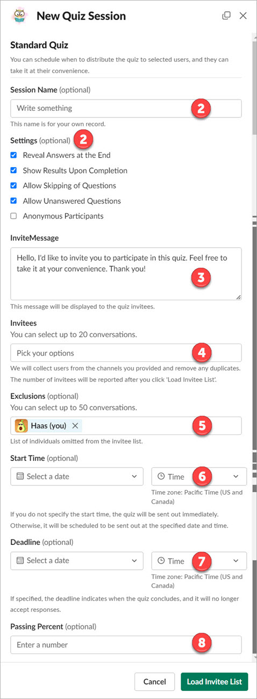

1. **Session Name:** This field is optional. It serves as the session name for your recording, providing a memorable identifier for this quiz session.
2. **Settings:**
    - **Reveal answers at the end** If this option is selected, quiz participants can review their answers at the end of the quiz. Otherwise, the system will not reveal the answers.
    - **Show results upon completion** If this option is selected, quiz participants will have the ability to view their total scores at the end of the quiz.
    - **Allow skipping of questions** If this option is selected, quiz participants will have the option to skip questions and return to them later. Additionally, at the end of the quiz, participants can view which questions they haven't answered and jump directly to those unanswered questions.
    - **Allow unanswered questions** If this option is selected, quiz participants will have the option to leave some or all questions unanswered before submitting the quiz. Otherwise, they won't be able to submit the quiz if there are unanswered questions.
    - **Anonymous participants** If this option is selected, participant names won't be recorded. The quiz moderator will not know which quiz results belong to whom.
3. **Invite Message:** The invite message will be shown along with the quiz title, description, and other quiz information. You can customize this or use the default one.
4. **Invitees:** You can select private channels, public channels, or individual users, up to 20 items. For example, if the channel named 'general' has 200 users, all those users will be included in the invitee list. The final invitee list will be deduplicated, as users may be members of multiple channels. You can export the invitee list to review and exclude specific participants if needed.
5. **Exclusions:** You can add up to 50 users to the exclusion list. 
6. **Start Time:** You can specify the future date and time for when the quiz will be delivered to all invitees. If not specified, the start time will default to the current time.
7. **Deadline:** You can specify the future date and time when the quiz will no longer accept responses from users. If not specified, it means there is no deadline.
8. **Passing Percent:** You can specify the passing percentage from 0% to 100%. If you specify 0 or leave it blank, it means there is no passing percentage.

## Loading Invitees

Since this type of quiz supports a large number of participants, we won't ask you to manually input all individuals, as it could range from 10 to 1,000 users or anywhere outside of this range. This would be impractical and quite a cumbersome process. We aim to make this process as easy as possible for you. You can specify channels, and we will retrieve all members from those channels, deduplicating them across channels for you. This may require multiple API calls and could take more than a minute if the audience is particularly large. Once the loading is complete, you'll be able to export the list of invitees, allowing you to identify who you want to include or exclude.

When you initiate the **Load Invitee List** action, the system will commence the loading task in the background. Typically, this process takes only a few seconds if your list is not large.

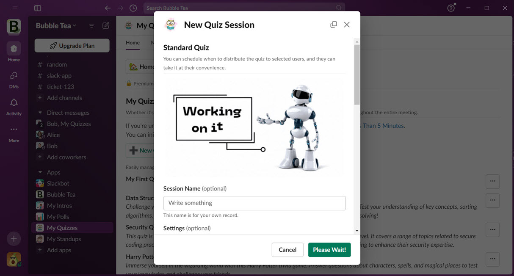

After the invitee list is ready, the system will report the total number of invitees. In this case, we have only 2 invitees.
Please click **Next** to proceed to the preview window.

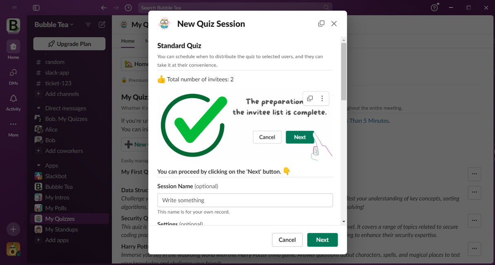

## Previewing the Configuration
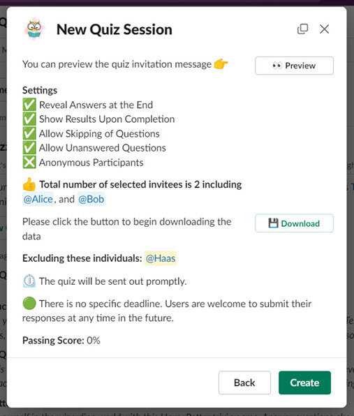

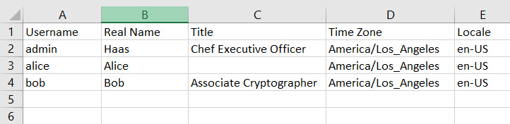

## Starting the Quiz
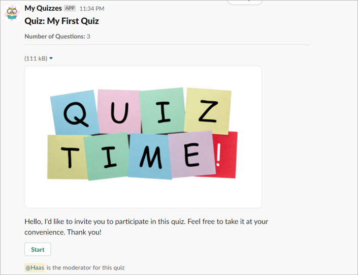

## Answering the Questions
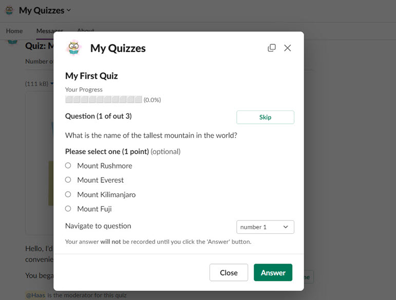
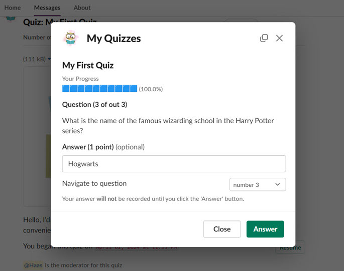

## Submitting the Quiz
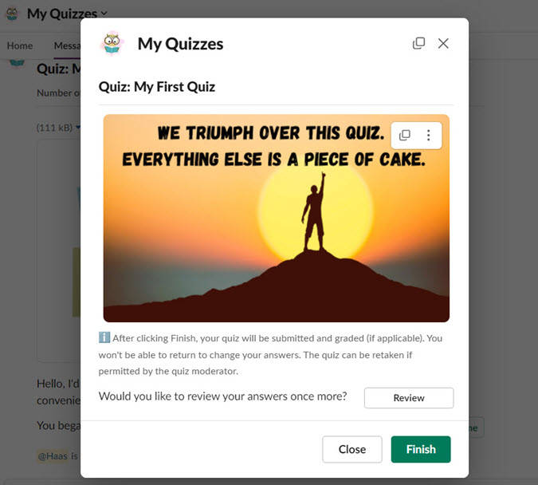

## Viewing the Score Report
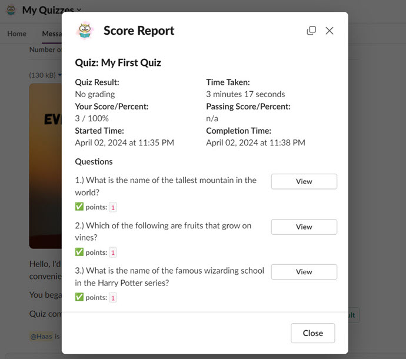

## Tracking Progress and Viewing Session Summary Report

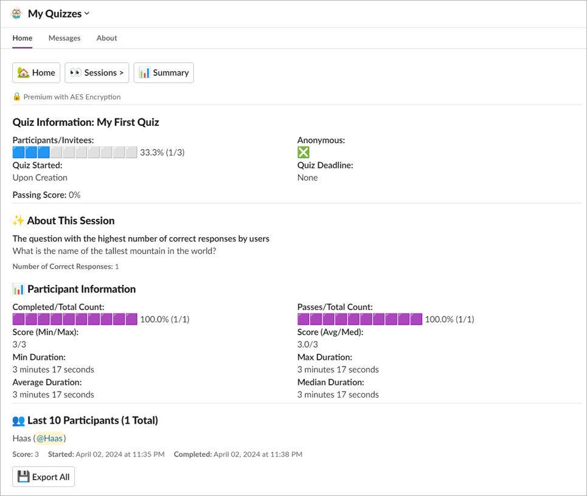